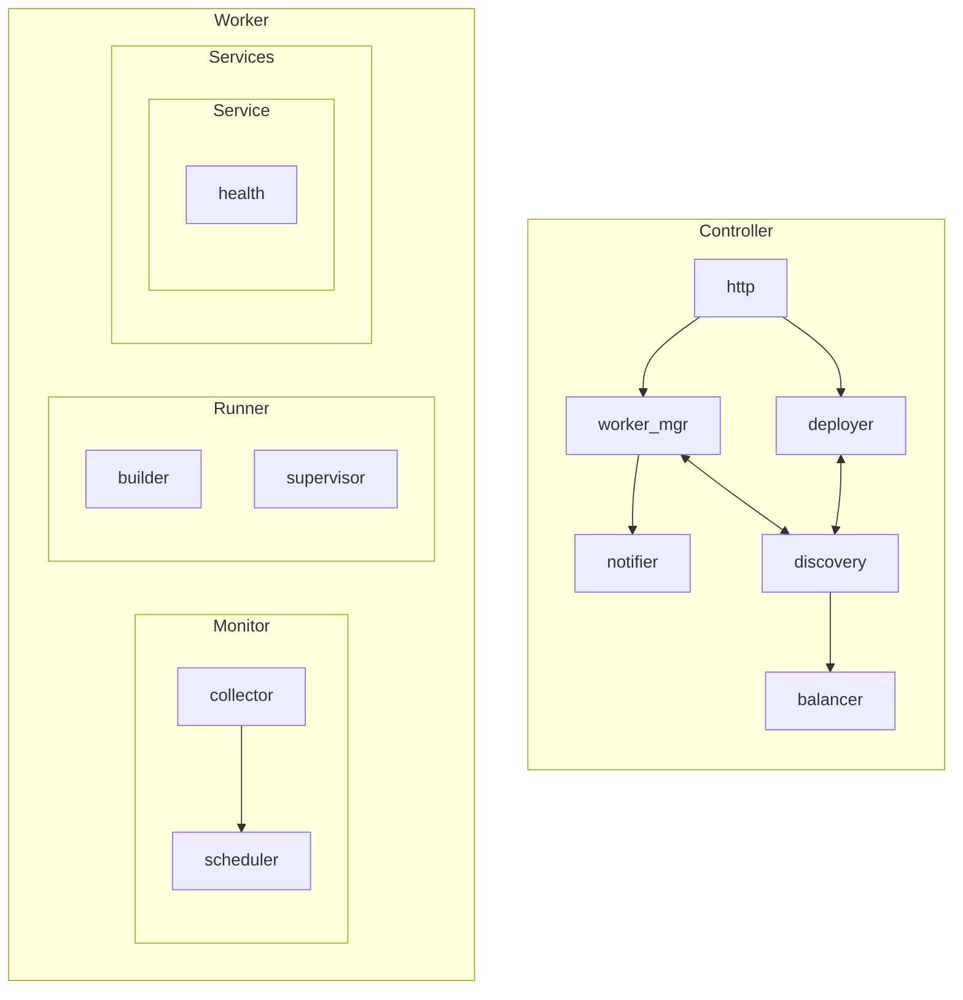

# Tucano

## Components

A Tucano cluster is comprised of a single "controller" and multiple "worker"
nodes. A controller node is responsible for managing the cluster and providing
load-balancing facilities. Worker nodes are responsible for running service
workloads.

Their main components are:

### Brief definitions

- **Controller**
  - `http` -> receives external requests from worker nodes or the system
    administrator's CLI and routes them to the appropriate component.
  - `deployer` -> handles service deployments and service teardown ("undeploy")
    requests.
  - `worker_mgr`
    - Receives and processes CPU and memory metrics from worker nodes.
    - Handles "dead" worker nodes.
    - Handles any errors that may occur within a worker node. For example, a
      failed deploy attempt.
  - `discovery` -> acts as a central database that records all available worker
    nodes and services that are currently running on the system.
  - `balancer` -> handles external-user requests and routes them to the
    appropriate service which is running on a worker node.
- **Worker**
  - **Monitor**
    - `collector` -> collects system metrics (average CPU and memory) from the
      corresponding worker node.
    - `scheduler` -> periodically calls the collector module to fetch the latest
      metrics, and sends them to the controller.
  - **Runner**
    - `builder` -> Builds a new service on the corresponding worker node
      (essentially, it is a glorified build script runner).
    - `supervisor` -> Runs a service's "runtime script" to properly start the
      service, and supervises such a service to handle errors, retries, etc. It
      may also optionally call a health check endpoint for the corresponding
      service.

# TODO

- Add sequence diagrams for communication patterns.
- Deployment options, etc.
