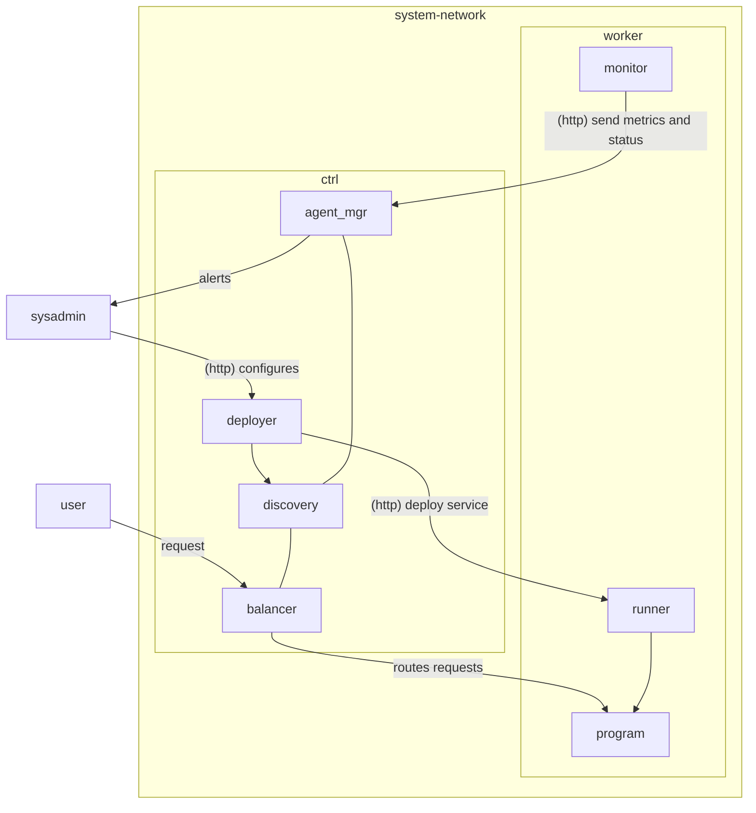

# Tucano

# Diagrama do sistema

# Definições iniciais

- `node`, um servidor que pertence à rede. Pode ser de dois tipos:
  - `ctl`, responsável por realizar o scheduling, etc.
  - `worker`, responsável por executar serviços em processos.
- `agent` um pequeno programa que roda em cada worker responsável por encaminhar
  métricas de uso ao controlador. Agents também são responsáveis por iniciar um
  processo (encaminhado pelo controlador) no worker correspondente.
- `service` um workload configurado para executar no sistema. Deve ser
  long-lived.[^required-long-lived]
- `process` um serviço que está sendo executado em algum `worker`.
  - Um mesmo worker pode executar vários processos (incluindo vários do mesmo
    serviço).
  - Os processos podem (incluindo vários do mesmo serviço) podem ser
    "horizontalmente escalados" em mais de um worker.

[^required-long-lived]:
    No momento, apenas o conceito de "service" está disponível; no futuro,
    podemos introduzir um conceito de "job", que executa workloads que não são
    _long-lived_, por exemplo a geração de um relatório PDF. A diferença é que
    "jobs" podem terminar, enquanto "services", por serem long-lived, não.

# Descrição dos componentes

- `ctl`
  - `deployer` -> Aceita a configuração estática de um serviço (inclui a
    configuração em si junto da imagem) e inicia o processo de deploy de acordo
    com os parâmetros especificados na configuração. Estará disponível a partir
    de um endpoint no controlador.
  - `balancer` -> Balanceia a carga (requisições recebidas) aos nós
    correspondentes.
  - `agent_mgr` -> Recebe informações dos agents e lida com eventuais "mortes"
    de workers, comunicando aos demais componentes do controlador.
  - `discovery` -> Mantém informações necessárias para realizar service
    discovery. É necessário para que o balancer possa saber _para onde_ uma
    determinada requisição deve ser roteada.
- `agent`
  - `monitor` -> Coleta métricas do worker e envia periodicamente ao
    controlador.
  - `runner` -> Recebe instruções de deploy do controlador e inicia o processo
    correspondente no worker.

# Ciclo de vida

Iremos assumir que todos os servidores serão configurados com um ambiente
[Ubuntu Server], assim minimizamos a possibilidade de conflitos entre diferentes
servidores.

[Ubuntu Server]: https://ubuntu.com/download/server

## Controlador

1. Instala-se o programa `tucano_ctld`, que fica responsável por todo o
   scheduling, balanceamento de carga, etc.
2. Inicia o programa `tucano_ctld`, que passará a executar continuamente as duas
   rotinas descritas a seguir.

### Processo de deploy

A partir da configuração estática de um `service` (que inclui tanto a
configuração quanto a "imagem"), o controlador deve ser capaz de alocar
processos em workers.

Essa alocação deve ser feita (de modo _round robin_) respeitando os limites de
concorrência especificados na configuração do serviço.

### Coleta de informações dos _agents_

1. Periodicamente, o controlador irá _receber_ (em um endpoint pré-definido)
   informações de cada agent.
2. A partir das métricas recebidas, o controlador deve consolidar a informação
   em `alive_nodes` para persistir o estado mais recente de utilização daquele
   nó. Essa informação será então utilizada pelo balanceador de carga.

### Aceitação de requisições

1. A partir da configuração estática dos serviços submetidos ao controlador,
   este poderá ser capaz de realizar balanceamento de carga.
2. Recebe requisição.
3. Determina qual serviço está associado a requisição.
4. Determina quais nós da rede estão executando aquele serviço.
5. Roteia a requisição para a porta que está rodando o serviço no nó escolhido.

## Worker

O worker é gerenciado por agents. Worker coleta informações e faz o deploy.

(...)

# Configurações ("estática")

## Configuração do controlador

- `topology` -> lista todas as máquinas a serem utilizadas como nós (tanto
  controlador quanto workers) no sistema.[^topology-not-alive]
  - `kind` -> Especifica se a máquina é um nó controlador ou worker.
  - `ip` -> Endereço real da máquina.

Embora seja ideal (especialmente sob a perspectiva de alta disponibilidade) ter
um sistema com vários controladores disponíveis, para simplificar o trabalho
optaremos por impor um limite de apenas _um_ controlador por sistema. Se mais de
um nó for especificado como controlador na configuração, a inicialização do
sistema falhará.

[^topology-not-alive]:
    Se uma máquina listada em `topology` não estiver disponível (i.e., não
    estiver _alive_), durante a execução do sistema, o controlador envia algum
    tipo de alerta para o administrador do sistema.

## Configuração do agent

- `publish_interval` -> Intervalo para envio de métricas coletadas pelo agent ao
  controlador.

## Configuração do serviço

- `concurrency` quantidade de processos no sistema que devem estar executando o
  serviço correspondente, de maneira simultânea.
- `image` referência à imagem utilizada pelo processo. Contém instruções de
  build e execução.
- `port` especifica qual porta deve ser aberta.

# Informações em runtime

## Controlador

Estas são as informações mantidas em runtime pelo controlador:

- `alive_nodes` -> Lista com todos os nós _vivos_ na rede (essa lista é derivada
  da configuração `topology`).
- `dead_nodes` -> Lista os nós mortos que não puderam ser reiniciados.
- `configured_services` -> Lista de todos os serviços configurados. Note que um
  serviço configurado não necessariamente precisa estar em execução.
  - A configuração _estática_ de cada serviço (que foi submetida ao controlador
    pelo usuário) fica disponível aqui.
- `active_services` -> Lista de todos os serviços que estão _em execução_ na
  rede.
  - Possui uma referência pra o registro correspondente em
    `configured_services`.

# Referências
