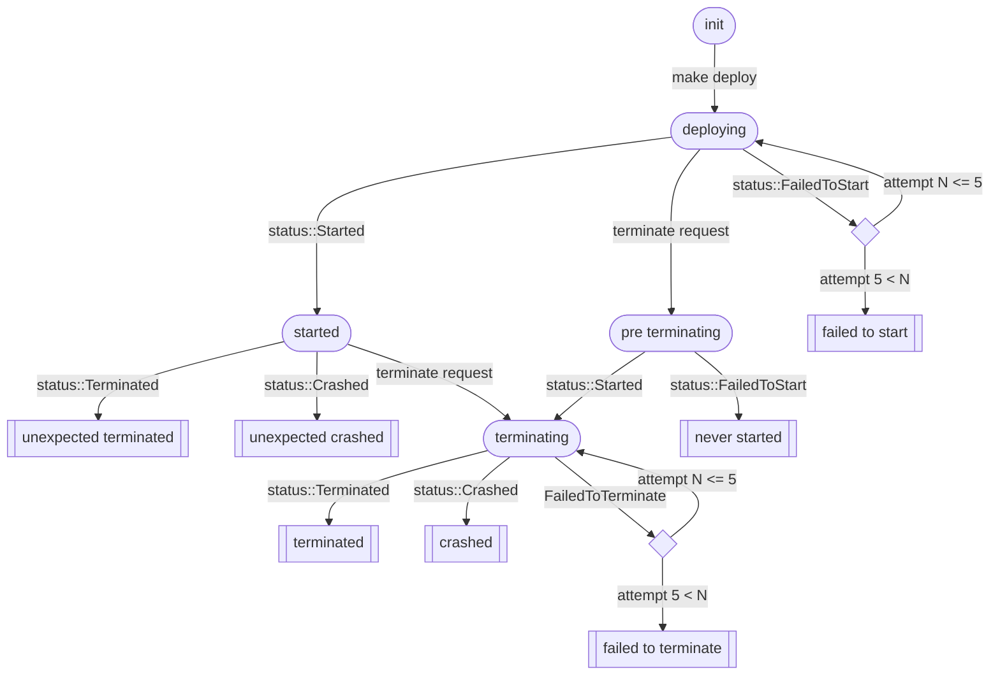

```mermaid
flowchart TD
    init([init])
    init -->|make deploy| deploying

    deploying([deploying])
    deploying -->|status::FailedToStart| start_fail_dec
    deploying -->|status::Started| started
    deploying --->|terminate request| pre_terminating

    start_fail_dec{ }
    start_fail_dec -->|attempt N <= 5| deploying
    start_fail_dec -->|attempt 5 < N| failed_to_start

    failed_to_start[[failed to start]]

    started([started])
    started -->|status::Terminated| unexpected_terminated
    started -->|status::Crashed| unexpected_crashed
    started -->|terminate request| terminating

    unexpected_terminated[[unexpected terminated]]
    unexpected_crashed[[unexpected crashed]]

    pre_terminating([pre terminating])
    pre_terminating -->|status::Started| terminating
    pre_terminating -->|status::FailedToStart| never_started

    never_started[[never started]]

    terminating([terminating])
    terminating -->|status::Terminated| terminated
    terminating -->|status::Crashed| crashed
    terminating -->|FailedToTerminate| term_fail_dec

    term_fail_dec{ }
    term_fail_dec -->|attempt N <= 5| terminating
    term_fail_dec -->|attempt 5 < N| failed_to_terminate

    failed_to_terminate[[failed to terminate]]

    terminated[[terminated]]
    crashed[[crashed]]
```
