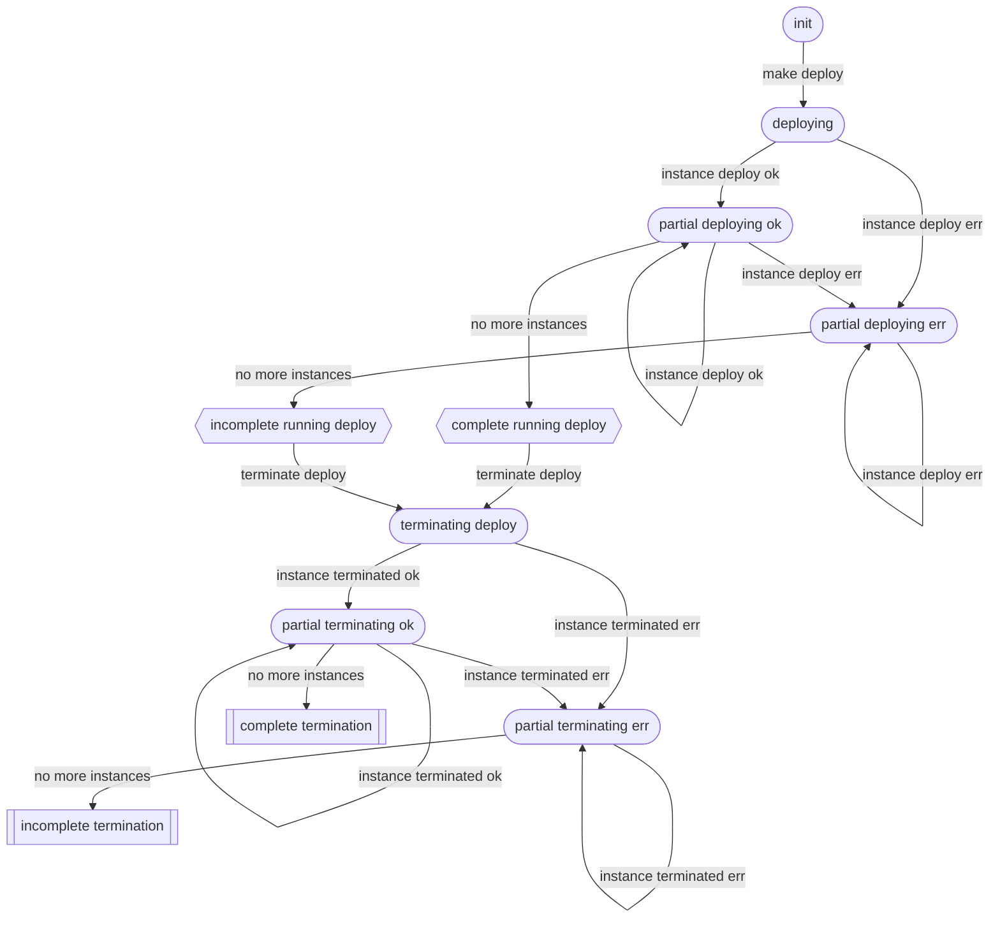
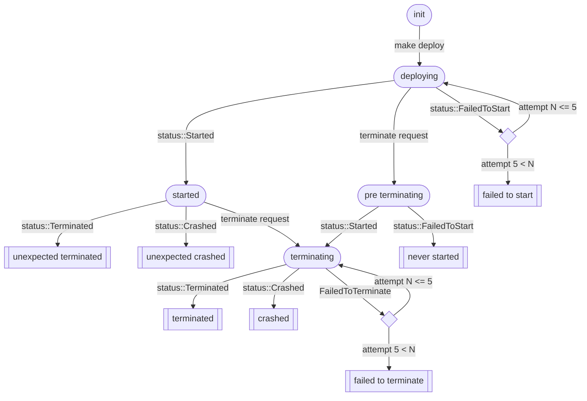

# Service (TODO)

```mermaid
flowchart TD
    init([init])
    init -->|make deploy| deploying

    deploying([deploying])
    deploying -->|instance deploy ok| part_ok
    deploying -->|instance deploy err| part_err

    part_ok([partial deploying ok])
    part_ok -->|instance deploy ok| part_ok
    part_ok -->|no more instances| r_ok
    part_ok -->|instance deploy err| part_err

    part_err([partial deploying err])
    part_err -->|instance deploy ok| part_err
    part_err -->|instance deploy err| part_err
    part_err -->|no more instances| r_err

    r_ok{{complete running deploy}}
    r_ok -->|terminate deploy| terminating

    r_err{{incomplete running deploy}}
    r_err -->|terminate deploy| terminating

    terminating([terminating deploy])
    terminating -->|instance terminated ok| part_term_ok
    terminating -->|instance terminated err| part_term_err

    part_term_ok([partial terminating ok])
    part_term_ok -->|instance terminated ok| part_term_ok
    part_term_ok -->|no more instances| term_ok
    part_term_ok -->|instance terminated err| part_term_err

    part_term_err([partial terminating err])
    part_term_err -->|instance terminated ok| part_term_err
    part_term_err -->|instance terminated err| part_term_err
    part_term_err -->|no more instances| term_err

    term_ok[[complete termination]]
    term_err[[incomplete termination]]
```

# Instance

```mermaid
flowchart TD
    init([init])
    init -->|make deploy| deploying

    deploying([deploying])
    deploying -->|status::FailedToStart| start_fail_dec
    deploying -->|status::Started| started
    deploying --->|terminate request| pre_terminating

    start_fail_dec{ }
    start_fail_dec -->|attempt N <= 5| deploying
    start_fail_dec -->|attempt 5 < N| failed_to_start

    failed_to_start[[failed to start]]

    started([started])
    started -->|status::Terminated| unexpected_terminated
    started -->|status::Crashed| unexpected_crashed
    started -->|terminate request| terminating

    unexpected_terminated[[unexpected terminated]]
    unexpected_crashed[[unexpected crashed]]

    pre_terminating([pre terminating])
    pre_terminating -->|status::Started| terminating
    pre_terminating -->|status::FailedToStart| never_started

    never_started[[never started]]

    terminating([terminating])
    terminating -->|status::Terminated| terminated
    terminating -->|status::Crashed| crashed
    terminating -->|FailedToTerminate| term_fail_dec

    term_fail_dec{ }
    term_fail_dec -->|attempt N <= 5| terminating
    term_fail_dec -->|attempt 5 < N| failed_to_terminate

    failed_to_terminate[[failed to terminate]]

    terminated[[terminated]]
    crashed[[crashed]]
```
